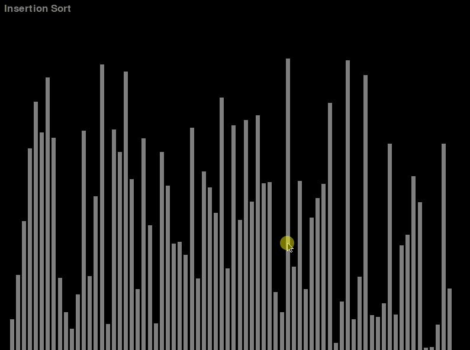

# Sorting Algorithm Visualizer
A bunch of boring old sorting algorithms...visualized!!!

  
  
  
  

# Requirements
Python 3.8.3 and Pygame 1.9.6

# How to use!
Just clone the repository and run visualizer.py.

`python visualizer.py`

# Structure
algorithms - holds non-graphical implementations of the sorting algorithms

readmeAssets - those beautiful gifs (thanks screen to gif!)

visualizerModules - modules for the visualizer

tools - some helpful tools for the visualizer and algorithms

algoTest.py - algorithm unit testing

menuTest.py - menu.py testing 

visualizer.py - run this for those pretty visualizations!

# Planned Features (in no particular order)
- [x] Menu
- [ ] Cocktail Sort
- [X] Shell Sort

# Potential Features (again, in no particular order)
- [ ] Other sorting algorithms?
- [ ] Complexity information during sort
- [ ] Ability to change number of elements
